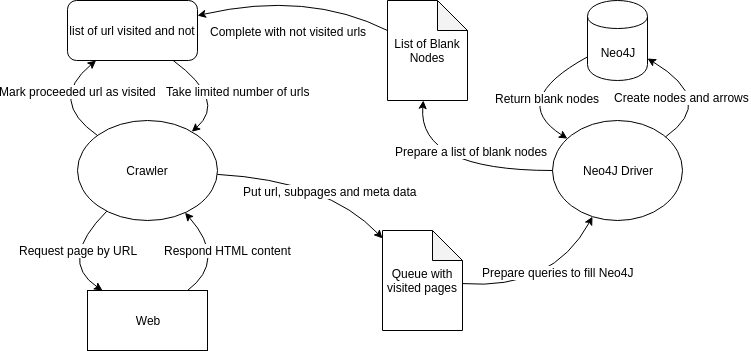

# Crawler

Create script that, for a given website, generates a graph in Neo4j of
all (or a reasonable amount of) subpages and their connections. Each
node should contain the URI, title, summary of content (extracted from
h\* tags, title, etc.).

# Before

1. [Download](https://neo4j.com/download-center/) and run Neo4J Community Edition (version 3.5.5 is recommended). 
2. Remember to store localhost port in case it is different than 7687

For development, the best way is to install jupyter notebook and use it to run project.
Then the results should be visible after opening http://localhost:7474 

# Architecture

List of blank nodes is a python list of url, which do not have meta data in database yet.

Queue with visited pages is a python queue containing tuples with additional information about crawled page in form: (crawled_url, [founded_urls], {meta_data}).

The meta data map (key-value storage) contains:
- title,
- language,
- author,
- subject,
- keywords,
- description.

If page do not provide meta data, value for above key is set to None. The list with founded_urls may be empty.

Important thing is, that crawled_url could already exist in Neo4J database. That's why Driver should first check existance for currently proceeding url in database and decide if it should be updated or created.

List of url visited by crawler should be at first filled with staring web page url. Crawler should use this list to store founded urls, get some to futher crawling and mark visited ones. The crawler will finish, when no blank nodes left in database and no more unvisited url left in list. Crawler provide parameter to set limit of size of queue with tuples of visited pages, before the driver will start preparing queries.
